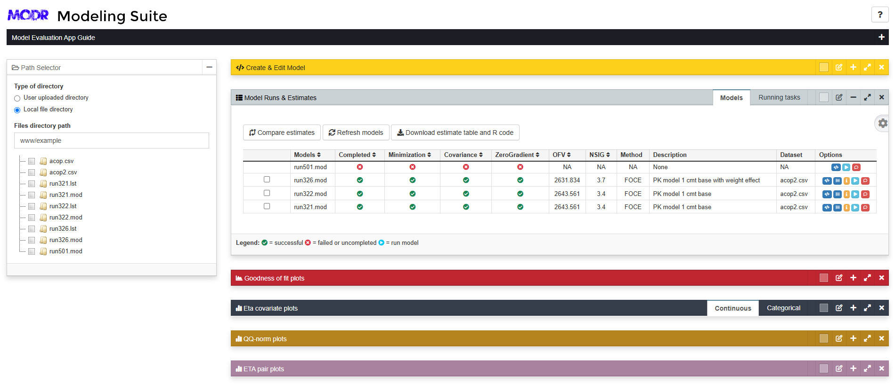

# SCIENTIST I: Pharmacometrician for Model Evaluations [Shiny]





__Sample version 1 deployed template__: https://pharmacometric.shinyapps.io/pharmacometric-model-eval/

Standardizing and automatically generating R scripts for creating model evaluation outputs, such as goodness of fit plots and visual predictive check plots, is crucial for ensuring consistency, reproducibility, and clarity in data presentation. Standardized scripts facilitate collaboration among researchers by providing a common framework that reduces variability in analysis and interpretation. 
The current shiny template for models, plays a vital role in this standardization effort by automating the generation of R code for all scripts used in creating plots and tables. This automation not only streamlines the workflow but also minimizes the risk of errors, allowing researchers to focus on the scientific interpretation of their results rather than the intricacies of coding. 

### Current limitation

This dashboard works only with NONMEM based models.

Should we create functionality for ADAPT 5 (or other software) models. We need enough interests to do it. Let us know here : https://github.com/pharmacometric/pharmacometric-shiny-template-model/issues/1

### Usage 
```r

# Download and unzip the content of this repository
# Set working directory to the unzipped folder
setwd("pharmacometric-shiny-template-model")

# Load shiny and run app
library(shiny)
runApp(launch.browser = 1L)

```


```
# Required libraries and versions
tools, version 4.4.1
shinyTree, version 0.3.1
nonmem2R, version 0.2.5
shinyAce, version 0.4.4
shiny, version 1.8.1.1
shinyjs, version 2.1.0
shinyStorePlus, version 1.4
DT, version 0.33
flextable, version 0.9.6
nlme, version 3.1.166
markdown, version 1.13
tibble, version 3.2.1
card.pro, version 2.3.0
dplyr, version 1.1.4
tidyr, version 1.3.1
ggplot2, version 3.5.1
magrittr, version 2.0.3
mrgsolve, version 1.5.1
quickcode, version 1.0.5
patchwork, version 1.3.0
table1, version 1.4.3
r2resize, version 1.9.2
rlang, version 1.1.4
grid, version 4.4.1
ggthemes, version 5.1.0
NMdata, version 0.1.9
GGally, version 2.2.1
```

### !IMPORTANT

For model runs, the below code is being run in terminal. You can modify it in "includes/body/gofplot/server.R" line 182 with your preferred format for your PsN or NONMEM installation.

```
psn74 execute FILENAME.mod

```

### Features

The following features are available in the current template for you to get started.

 - __Pre-built modules__ Already configured set-up for modules for exploratory data analysis. User may tweak further to their specific routines
 - __Example data & uploads__ Availability of data to test out the app, but also a feature that allows upload of user dataset for analysis
 - __Plot/table output and code download__ Download all output plots and tables either as final outputs (png/docx) or objects (ggplot/flextable/table1) or code download to direct use in submissions
 - __User customizable interface__. This means the user can move around the panels to desired locations on the screen. They may also change the title and color of the panels to suite their needs. 
 - __Panel location and features saved across sessions__. This means that after re-arrangement of panels, changing panel colors or titles, one may refresh the page and the settings are retained.
 - __Resizable Panels__. Panels are resizable to allow easy focus on specific contents, like plots or tables of result.
 - __Aesthetics for completion__. App title are formatted to look professional. A sample icon is also provided, which may be replaced when updating the template to suit your need.
 
 
 
### Issues

If you have issues or questions, create an 'issue' or contribute to one within the issue tab of this github repository


### Contributors

Contributors interact with the project on GitHub by filing new issues, improving existing issues, or submitting pull requests. Anyone can become a contributor, which means there is no expectation of commitment to the project, no required set of skills, and no selection process.
